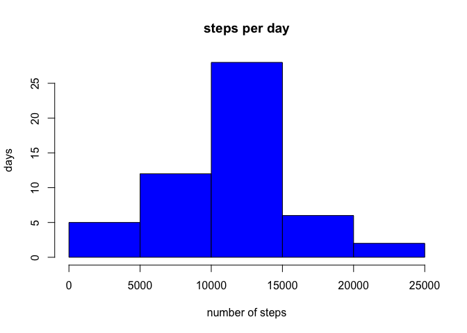
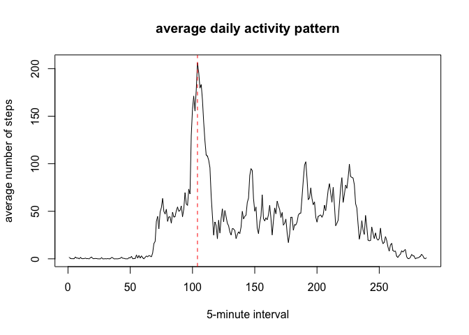
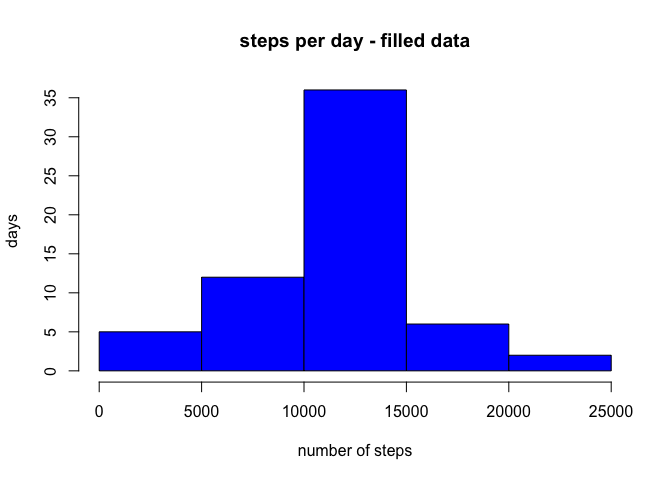
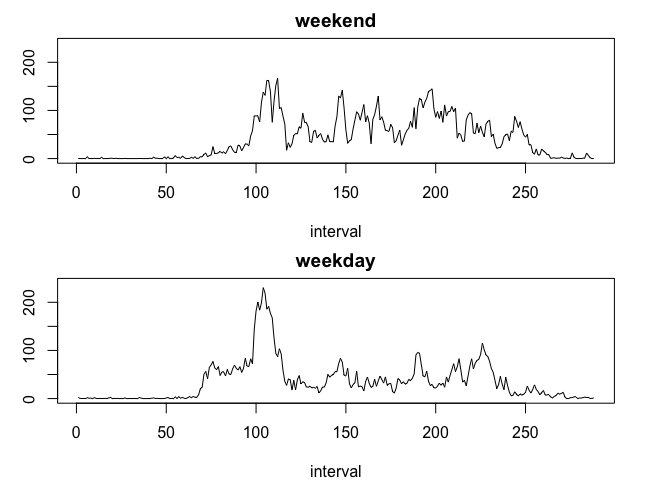

# Reproducible Research: Peer Assessment 1


## Loading and preprocessing the data

Here I am going to set working directory. Also, download and unzip the data.


```r
setwd('/Users/jacek/Documents/Repositories/RepData_PeerAssessment1')
url = 'https://d396qusza40orc.cloudfront.net/repdata%2Fdata%2Factivity.zip'

download.file(url,'activity.zip', method='curl')
unzip('activity.zip')
```

Now, I'll read the data file. Additionally, I'll change the type of 'date' collumn to data-type "Date"


```r
data = read.csv('activity.csv')
data$date = as.Date(data$date)
```

## What is mean total number of steps taken per day?

Here, I'll calculate total number of steps taken per day


```r
steps_per_day = tapply(data$steps,data$date,sum)
```

Now, the histogram...


```r
hist(steps_per_day,main = 'steps per day', xlab = 'number of steps', ylab = 'days', col = 'blue')
```

 

...and mean and median of total number of steps per day.


```r
mean(steps_per_day, na.rm = T)
```

```
## [1] 10766.19
```

```r
median(steps_per_day, na.rm = T)
```

```
## [1] 10765
```


## What is the average daily activity pattern?

First, let's calculate daily activity patern.


```r
daily_step_pattern = tapply(data$steps,data$interval,mean, na.rm = T)
```

Next, I'll calculate which 5-minute interval, on average across all days in the dataset, contains the maximum number of steps.


```r
max_steps_index = which.max(daily_step_pattern)
unname(max_steps_index)
```

```
## [1] 104
```

Here, I'll plot daily activity pattern with selected 5-minute interval marked with red broken line.


```r
plot(daily_step_pattern, type ='l', 
     xlab = '5-minute interval', 
     ylab = 'average number of steps', 
     main = 'average daily activity pattern')
abline(v = max_steps_index, col = 'red', lty = 2)
```

 

## Imputing missing values

Here, I'll check the number of missing values for each collumn.


```r
NAs = is.na(data)
colSums(NAs)
```

```
##    steps     date interval 
##     2304        0        0
```
There are missing values only in 'steps' variable.

Now, I'll replace missing values with means corresponding to 5-minute-interval from 'daily_step_pattern' variable, from previous section.

First, I'll repeat 'daily_step_pattern' so its length is equal to the length of 'steps' variable.

```r
DWP_rep = rep(daily_step_pattern,length.out = nrow(data))
```

Now, I'll create new dataset and fill it in missing values with corresponding mean values.

```r
data_filled = data
data_filled$steps[is.na(data$steps)] = DWP_rep[is.na(data$steps)]
```

Now, I'll calculate total number of steps per day using new dataset...


```r
steps_per_day_filled = tapply(data_filled$steps,data_filled$date,sum)
```

... and plot the histogram...


```r
hist(steps_per_day_filled,main = 'steps per day - filled data', xlab = 'number of steps', ylab = 'days', col = 'blue')
```

 

... with mean and median of total number of steps per day.


```r
mean(steps_per_day_filled)
```

```
## [1] 10766.19
```

```r
median(steps_per_day_filled)
```

```
## [1] 10766.19
```

It shows that filling missing values with corresponding mean 5 minutes intervals values does not change mean of total number of steps taken per day and affects median just slightly.

## Are there differences in activity patterns between weekdays and weekends?

First, I'll create new factor variable with weekdays...


```r
WD = as.factor(weekdays(data_filled$date))
levels(WD)
```

```
## [1] "Friday"    "Monday"    "Saturday"  "Sunday"    "Thursday"  "Tuesday"  
## [7] "Wednesday"
```

... and change levels to 'weekday' and 'weekend'.


```r
levels(WD) = c('weekday','weekday','weekend' ,'weekend','weekday','weekday','weekday')
```

Now, I'll add new variable to analyzed dataset.


```r
data_filled$WD = WD
```

Next, I'll create two new datasets corresponding to weekdays and weekends.


```r
data_weekend = data_filled[data_filled$WD == 'weekend',]
data_weekday = data_filled[data_filled$WD == 'weekday',]
```

Here, I'll calculate two separate daily activity patterns for weekdays and weekends...


```r
weekend_step_pattern = tapply(data_weekend$steps,data_weekend$interval,mean)
weekday_step_pattern = tapply(data_weekday$steps,data_weekday$interval,mean)
```

... and plot. For comparision purposes I'll set up the same limits on 'y' axes on both plots.


```r
par(mfrow=c(2,1), mar = c(4,3,2,3))

plot(weekend_step_pattern, type='l', main = 'weekend', xlab = 'interval', ylab = 'steps', ylim = c(0,240))
plot(weekday_step_pattern, type='l', main = 'weekday', xlab = 'interval', ylab = 'steps', ylim = c(0,240))
```

 


